# qkyd - 健康管理平台

> 基于若依（RuoYi）框架构建的智能健康管理平台，集成 AI 算法与多源健康数据监测能力。

---

## 变更记录 (Changelog)

| 日期 | 版本 | 变更内容 |
|------|------|----------|
| 2026-02-01 14:18:39 | v3.8.7 | 初始化 AI 上下文文档，生成模块索引与架构概览 |

---

## 项目愿景

qkyd 是一个面向老年人和慢病人群的智能健康管理平台，通过智能穿戴设备（手表、手环）采集健康数据，结合 AI 算法进行异常检测、趋势分析和风险评估，为家庭照护和医疗服务提供数据支持。

### 核心能力
- **多源数据采集**：心率、血氧、体温、血压、步数、位置轨迹等
- **AI 算法引擎**：异常检测、跌倒检测、趋势分析、风险评分、数据质量评估
- **实时监控预警**：电子围栏、异常告警、健康驾驶舱
- **设备管理**：设备绑定、状态监控、数据上报

---

## 架构总览

### 技术栈
- **后端**：Java 17 + Spring Boot 3.2.5 + MyBatis + Spring Security 6 + Spring AI
- **前端**：Vue 3 + Element Plus + Vite + Pinia + Vue Router
- **数据库**：MySQL 8.0 + Redis
- **AI 集成**：Python 算法服务（独立部署）、Spring AI OpenAI

### 部署架构
```
[前端 Vue3] <---> [后端 Spring Boot] <---> [MySQL + Redis]
                         |
                         +---> [Python 算法服务] (异常检测、跌倒检测等)
                         +---> [OpenAI API] (可选，健康建议生成)
```

---

## 模块结构图

```mermaid
graph TD
    A["(根) qkyd 健康管理平台"] --> B["qkyd-admin - Web服务入口"];
    A --> C["qkyd-framework - 核心框架"];
    A --> D["qkyd-system - 系统管理"];
    A --> E["qkyd-common - 通用工具"];
    A --> F["qkyd-health - 健康数据"];
    A --> G["qkyd-ai - AI算法"];
    A --> H["qkyd-quartz - 定时任务"];
    A --> I["qkyd-generator - 代码生成"];
    A --> J["RuoYi-Vue3-Modern - 前端"];

    click B "./qkyd-admin/AGENTS.md" "查看 admin 模块文档"
    click C "./qkyd-framework/AGENTS.md" "查看 framework 模块文档"
    click D "./qkyd-system/AGENTS.md" "查看 system 模块文档"
    click E "./qkyd-common/AGENTS.md" "查看 common 模块文档"
    click F "./qkyd-health/AGENTS.md" "查看 health 模块文档"
    click G "./qkyd-ai/AGENTS.md" "查看 ai 模块文档"
    click H "./qkyd-quartz/AGENTS.md" "查看 quartz 模块文档"
    click I "./qkyd-generator/AGENTS.md" "查看 generator 模块文档"
    click J "./RuoYi-Vue3-Modern/AGENTS.md" "查看前端模块文档"
```



---

## 模块索引

| 模块路径 | 职责 | 语言 | 入口文件 |
|---------|------|------|----------|
| `qkyd-admin` | Web 服务入口、控制器层 | Java | `RuoYiApplication.java` |
| `qkyd-framework` | 核心框架、安全配置、AOP | Java | - |
| `qkyd-system` | 系统管理（用户、角色、菜单、字典） | Java | - |
| `qkyd-common` | 通用工具类、异常、注解 | Java | - |
| `qkyd-health` | 健康数据管理（设备、心率、血氧等） | Java | - |
| `qkyd-ai` | AI 算法集成（异常检测、跌倒检测） | Java | - |
| `qkyd-quartz` | 定时任务调度 | Java | - |
| `qkyd-generator` | 代码生成器 | Java | - |
| `RuoYi-Vue3-Modern` | Vue3 前端应用 | JavaScript | `src/main.js` |

---

## 运行与开发

### 环境要求
- JDK 17+
- Node.js 18+
- Maven 3.6+
- MySQL 8.0+
- Redis 6+

### 后端启动
```bash
# 进入项目根目录
cd D:\jishe\1.19

# 编译打包（跳过测试）
mvn clean package -DskipTests

# 运行主程序
java -jar qkyd-admin/target/qkyd-admin.jar

# 或使用 IDE 启动
# 主类: com.qkyd.RuoYiApplication
# 默认端口: 8098
```

### 前端启动
```bash
# 进入前端目录
cd RuoYi-Vue3-Modern

# 安装依赖
npm install --registry=https://registry.npmmirror.com

# 启动开发服务器
npm run dev

# 访问地址: http://localhost:8080
```

### 数据库初始化
```bash
# 导入数据库脚本
mysql -u root -p qkyd_jkpt < sql/qkyd_jkpt.sql
```

---

## 测试策略

### 单元测试
- 位置：各模块的 `src/test/java` 目录
- 框架：JUnit 5 + Mockito
- 运行：`mvn test`

### API 测试
- Swagger UI: http://localhost:8098/doc.html
- SpringDoc OpenAPI 集成

### 前端测试
- 暂无自动化测试配置

---

## 编码规范

### Java 规范
- 遵循阿里巴巴 Java 开发手册
- 包名：`com.qkyd.{模块名}`
- Controller 路径：`/api/{模块}/{功能}`

### 前端规范
- 组件命名：PascalCase
- 文件命名：kebab-case（目录）、camelCase（工具）
- API 请求：统一使用 `@/api` 下的模块化 API 文件

---

## AI 使用指引

### 推荐的 AI 辅助场景
1. **新功能开发**：参考 `qkyd-generator` 代码生成器，快速生成 CRUD
2. **Bug 修复**：利用全局异常处理（`GlobalExceptionHandler`）定位问题
3. **代码审查**：关注 Spring Security 配置和数据权限控制
4. **API 调试**：使用 Swagger UI 测试接口

### 上下文提示词示例
- "帮我生成一个健康指标的 CRUD 功能，参考 qkyd-health 模块"
- "解释 qkyd-ai 模块中异常检测的调用链路"
- "如何添加一个新的 AI 算法接口？"

---

## 相关资源

- [部署指南](./DEPLOYMENT_GUIDE.md)
- [数据库脚本](./sql/)
- [若依官方文档](http://doc.ruoyi.vip)

---

**最后更新**: 2026-02-01 14:18:39
**文档版本**: v1.0.0
