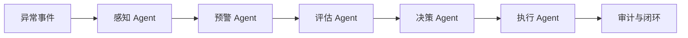

# 多 Agent 协同说明

本文档说明耆康云盾健康监测平台中的多 Agent 协同能力，包括
架构设计、协同链路、核心实现、数据落库方式，以及当前边界。

这套实现不再是前端模拟流程或单纯的概念包装。系统已经具备
真实的 Agent 编排、真实的执行轨迹、真实的状态查询，以及真实的
前端协同展示页面。

## 目标与定位

本项目面向养老健康监测场景，围绕异常健康事件构建了一个
业务闭环型多 Agent 协同系统。它的目标不是做通用自治 Agent
平台，而是把健康风险预警场景中的关键处理环节拆分成职责清晰、
可追踪、可审计的五类 Agent。

当前系统强调的是“分工协同”和“闭环执行”，而不是开放式博弈、
自由规划或无边界自治。

## 五类 Agent 分工

系统目前将健康风险预警链路拆分为以下五类 Agent。

### 感知 Agent

感知 Agent 负责读取异常事件源数据，并补齐对象、设备、位置、
发生时间等上下文，形成标准化协同输入。

对应实现：

- `backend/qkyd-ai/src/main/java/com/qkyd/ai/agent/impl/PerceptionEventPipelineAgent.java`

### 预警 Agent

预警 Agent 负责把异常数据转化为可处理的风险事件，并结合优先级
决定是否继续进入后续协同流程。

对应实现：

- `backend/qkyd-ai/src/main/java/com/qkyd/ai/agent/impl/WarningEventPipelineAgent.java`

### 评估 Agent

评估 Agent 负责调用风险评分服务，对当前事件输出风险分数和风险
等级，形成量化结果。

对应实现：

- `backend/qkyd-ai/src/main/java/com/qkyd/ai/agent/impl/AssessmentEventPipelineAgent.java`

### 决策 Agent

决策 Agent 负责调用事件洞察服务，生成医学语义分析、处置建议、
通知对象等结构化结果。

对应实现：

- `backend/qkyd-ai/src/main/java/com/qkyd/ai/agent/impl/DecisionEventPipelineAgent.java`

### 执行 Agent

执行 Agent 负责依据规则引擎生成处置建议、通知级别，以及自动执行
标记，推动事件进入处置闭环。

对应实现：

- `backend/qkyd-ai/src/main/java/com/qkyd/ai/agent/impl/ExecuteEventPipelineAgent.java`

## 协同流程

五类 Agent 共同组成一条面向异常事件的协同链路。

在运行时，这条链路表现为以下动作：

1. 系统接收一个真实异常事件 `eventId`。
2. 编排服务创建协同上下文 `EventPipelineAgentContext`。
3. 系统按顺序调度五个 Agent 执行。
4. 每个 Agent 输出摘要、详情、交接目标和结构化结果。
5. 系统把每个 Agent 的执行轨迹落库到执行日志表。
6. 前端实时查询协同状态、审计轨迹和洞察快照。

## 核心编排实现

多 Agent 协同的核心不在页面，而在后端编排和落库逻辑。

### 编排入口

协同流程由事件处理控制器暴露接口：

- `POST /ai/event-processing/start/{eventId}`
- `GET /ai/event-processing/status/{eventId}`
- `GET /ai/event-processing/audit-trail/{eventId}`

对应文件：

- `backend/qkyd-ai/src/main/java/com/qkyd/ai/controller/EventProcessingController.java`

### 编排服务

真实编排由以下服务完成：

- `backend/qkyd-ai/src/main/java/com/qkyd/ai/service/impl/EventProcessingPipelineServiceImpl.java`

它负责：

- 创建和补齐协同上下文
- 获取并排序所有 `EventPipelineAgent` Bean
- 顺序执行五类 Agent
- 更新主流程状态
- 写入 Agent 轨迹
- 返回给前端真实的 `agentTrace` 和 `stages`

### Agent 抽象

为了让每个 Agent 真正成为独立协作单元，系统定义了以下抽象：

- `EventPipelineAgent`
- `EventPipelineAgentContext`
- `EventPipelineAgentResult`

对应文件：

- `backend/qkyd-ai/src/main/java/com/qkyd/ai/agent/EventPipelineAgent.java`
- `backend/qkyd-ai/src/main/java/com/qkyd/ai/agent/EventPipelineAgentContext.java`
- `backend/qkyd-ai/src/main/java/com/qkyd/ai/agent/EventPipelineAgentResult.java`

这意味着每个 Agent 都拥有统一的输入、统一的输出、统一的状态，
而不是在一个方法里手写多段业务逻辑后再贴上 Agent 标签。

## 执行轨迹与数据留痕

多 Agent 协同是否成立，关键在于“是否可追踪”。本项目已经把
轨迹存储作为核心能力之一。

### Agent 执行日志

系统新增了 `ai_agent_execution_log` 表，用于记录每个 Agent 的
执行信息，包括：

- `agent_key`
- `agent_name`
- `status`
- `summary`
- `detail_text`
- `handoff_to`
- `input_payload`
- `output_payload`
- `started_at`
- `finished_at`
- `duration_ms`

对应文件：

- `backend/sql/create_ai_agent_execution_log_table.sql`
- `backend/qkyd-ai/src/main/java/com/qkyd/ai/agent/EventPipelineAgentTraceService.java`

### 主流程状态

系统继续使用主流程表保存事件级协同状态，例如：

- 当前阶段
- 风险等级
- 风险分数
- 处置建议
- 执行状态
- 自动执行标记

这些状态由 `EventProcessingPipelineServiceImpl` 维护，并作为协同
总览返回给前端。

### 审计日志

系统通过操作审计服务记录事件处置行为和关键处理节点。

对应文件：

- `backend/qkyd-ai/src/main/java/com/qkyd/ai/service/impl/OperationAuditServiceImpl.java`

## 前端协同展示

前端不再使用 `setTimeout`、模拟日志或本地假状态来冒充协同链路。
当前协同页面已经改为直接读取后端真实结果。

协同页面位置：

- `/ai/pipeline`

对应文件：

- `qkyd-vue3-new/src/views/ai/AiPipelineView.vue`

前端能力包括：

- 从异常事件表读取真实事件列表
- 调用真实启动接口发起协同
- 调用真实状态接口读取五类 Agent 的执行状态
- 展示真实 `agentTrace`
- 展示真实审计日志
- 展示真实洞察快照

启动与查询接口封装位于：

- `qkyd-vue3-new/src/api/processingChain.ts`

## 当前系统为什么算“真实多 Agent 协同”

和传统的串行业务流程相比，当前实现已经具备以下多 Agent 特征：

- 有明确的 Agent 边界，而不是单个服务内的逻辑分段
- 有统一的 Agent 输入输出模型
- 有真实的 Agent 执行顺序和交接关系
- 有真实的 Agent 轨迹落库
- 有面向 Agent 的状态查询接口
- 有基于真实轨迹的前端展示页面

因此，当前系统已经不是“展示型多 Agent”，而是“业务闭环型
多 Agent 协同系统”。

## 当前边界

虽然系统已经具备真实多 Agent 协同能力，但它仍然是“场景化协同
系统”，而不是通用自治平台。当前边界主要包括以下几点。

- Agent 之间仍然采用固定顺序编排，不是动态任务规划
- 执行 Agent 目前仍以规则引擎为主，还不是自学习执行体
- 人工确认和反馈学习已经有接口基础，但还可以继续增强
- 当前实现更适合答辩中的“分工协同”表述，不建议宣传为
  完全自治式多智能体系统

## 推荐答辩表述

如果你需要在答辩或论文中说明当前能力，可以使用下面这段话：

> 本系统已形成面向健康风险预警场景的五类智能体分工协同架构，
> 实现了从感知、预警、评估、决策到执行的真实协同处理链。系统
> 通过统一编排服务调度各 Agent，并将执行过程、输出结果和交接
> 轨迹持久化，从而支撑协同可视化、状态追踪和审计闭环。

## 使用方式

如果你想演示多 Agent 协同，可以按下面的流程操作。

1. 启动后端、前端和 AI 相关服务。
2. 在异常事件列表中选择一个真实事件。
3. 打开 **多Agent协同中心** 页面。
4. 点击 **启动协同**。
5. 查看五类 Agent 的执行状态、输出结果和审计记录。

## 后续可扩展方向

如果你想继续提升“多 Agent 协同质量”，下一步推荐优先做以下能力：

- 引入人工确认节点，形成人机协同执行 Agent
- 引入异步队列和重试机制，增强协同鲁棒性
- 将执行规则进一步配置化和版本化
- 增加反馈学习，把执行结果反哺模型和策略
- 引入超时、回退、人工接管等协同控制能力

## 相关文件索引

以下文件构成了当前多 Agent 协同的核心实现。

- `backend/qkyd-ai/src/main/java/com/qkyd/ai/controller/EventProcessingController.java`
- `backend/qkyd-ai/src/main/java/com/qkyd/ai/service/impl/EventProcessingPipelineServiceImpl.java`
- `backend/qkyd-ai/src/main/java/com/qkyd/ai/agent/EventPipelineAgent.java`
- `backend/qkyd-ai/src/main/java/com/qkyd/ai/agent/EventPipelineAgentContext.java`
- `backend/qkyd-ai/src/main/java/com/qkyd/ai/agent/EventPipelineAgentResult.java`
- `backend/qkyd-ai/src/main/java/com/qkyd/ai/agent/EventPipelineAgentTraceService.java`
- `backend/qkyd-ai/src/main/java/com/qkyd/ai/agent/impl/PerceptionEventPipelineAgent.java`
- `backend/qkyd-ai/src/main/java/com/qkyd/ai/agent/impl/WarningEventPipelineAgent.java`
- `backend/qkyd-ai/src/main/java/com/qkyd/ai/agent/impl/AssessmentEventPipelineAgent.java`
- `backend/qkyd-ai/src/main/java/com/qkyd/ai/agent/impl/DecisionEventPipelineAgent.java`
- `backend/qkyd-ai/src/main/java/com/qkyd/ai/agent/impl/ExecuteEventPipelineAgent.java`
- `backend/sql/create_ai_agent_execution_log_table.sql`
- `qkyd-vue3-new/src/api/processingChain.ts`
- `qkyd-vue3-new/src/views/ai/AiPipelineView.vue`

## Next steps

如果你后面还要做论文、PPT 或答辩材料，推荐把这份文档继续拆成
三部分：

- 架构图版
- 答辩讲稿版
- 论文书面版
