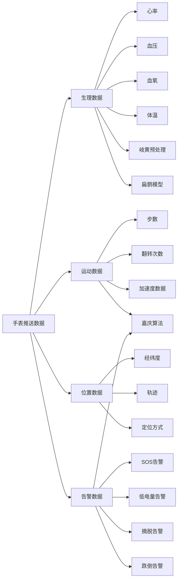
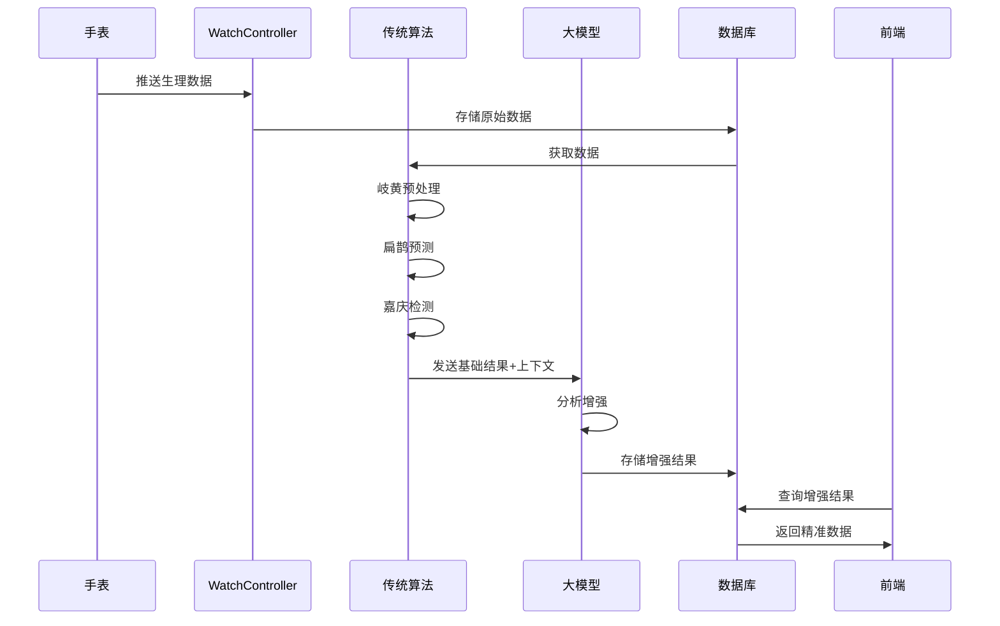

明白了！用户的核心思路是：
1. 不涉及视频采集，只利用手表现有数据
2. 用大模型增强数据处理的精准度
3. 三个算法模块：岐黄预处理、扁鹊模型、嘉庆算法
4. 目标是让处理更精准

这是一个完全不同的思路，不是用MiniCPM-V做视觉分析，而是用大模型增强数据质量、提升预测准确性。

让我重新分析：

1. 岐黄预处理：大模型可以做什么？
   - 分析数据缺失模式
   - 理解数据异常原因
   - 智能选择填充策略
   - 数据质量评估

2. 扁鹊模型：大模型可以做什么？
   - 特征工程增强（发现新的特征关系）
   - 模型解释（为什么预测高风险）
   - 个性化建议生成
   - 多模型融合决策

3. 嘉庆算法：大模型可以做什么？
   - 时序模式识别
   - 异常行为理解
   - 误报分析
   - 多维度数据融合

可行性分析：
- ✅ 只用手表现有数据，无需新增硬件
- ✅ 可以用大模型做增强，不需要替换核心算法
- ⚠️ 成本问题：大模型调用成本
- ⚠️ 效果问题：大模型对数值型数据处理能力

我需要给出一个清晰的、不涉及代码的评价和规划。
明白了！您的思路非常清晰：**用手表现有数据 + 大模型增强，提升三大算法的精准度**。让我重新分析这个方案的可行性和规划。

---

## 📊 核心理念重新定位

### 您的方案定位

```
传统思路（我之前说的）：
手表 + 摄像头 → MiniCPM-V视觉分析 → AI增强

您的思路（现在要的）：
手表数据 → 岐黄/扁鹊/嘉庆算法 → 大模型增强精准度
```

**关键变化**：
- ❌ 不需要摄像头/视频
- ✅ 只用手表现有数据（心率、血压、位置、加速度等）
- ✅ 大模型作为增强层，不替换核心算法
- ✅ 目标：提升数据处理和预测的精准度

---

## 🎯 项目现状与三大算法的匹配度

### 现有数据基础评估



### 数据与三大算法的对应关系

| 算法模块 | 主要数据源 | 数据特点 | 现有基础 |
|---------|-----------|---------|---------|
| **岐黄预处理** | 所有表（blood/heart_rate等） | 数值型、有时序缺失 | ✅ 7张核心表 |
| **扁鹊模型** | 血压、心率、血氧 | 多变量、时间序列 | ✅ 完整采集 |
| **嘉庆算法** | 加速度、翻转、告警 | 时序数据、模式识别 | ✅ 已有告警机制 |

---

## 🤔 大模型能做什么增强？

### 核心思路：大模型不是替代，而是增强

```
┌─────────────────────────────────────┐
│     原有数据处理流程                │
│  （岐黄/扁鹊/嘉庆算法）           │
└────────────┬───────────────────────┘
             ↓
     【传统算法输出结果】
             ↓
┌─────────────────────────────────────┐
│      大模型增强层                  │
│  （理解、分析、校正、解释）        │
└────────────┬───────────────────────┘
             ↓
     【增强后的精准结果】
```

### 三大算法的大模型增强点

---

## 📋 一、岐黄预处理 + 大模型增强

### 传统算法能做什么

```
热卡填充：
- 按相似度找到最相近的记录
- 用该记录的值填充缺失

缺失森林：
- 使用随机森林预测缺失值
- 考虑多个变量的关系

优势：计算快、可解释
局限：不考虑时间序列、不理解数据语义
```

### 大模型能增强什么

| 增强点 | 传统算法局限 | 大模型如何解决 |
|--------|-------------|---------------|
| **理解缺失原因** | 只看到"缺了"，不知道"为什么缺" | 分析时间戳、设备状态、告警记录，判断缺失原因 |
| **智能选择策略** | 固定一种填充方法 | 根据缺失模式动态选择最优策略 |
| **多维度融合** | 主要看数值本身 | 结合用户画像、历史规律、外部因素 |
| **质量评估** | 只能统计缺失率 | 评估填充合理性，标注置信度 |

### 典型场景举例

**场景1：夜间血压数据缺失**
```
用户张三，每天7:00、14:00、21:00测血压
但某天21:00数据缺失

传统算法：
→ 找相似用户填充
→ 或用该用户前一天21:00填充

大模型增强：
→ 分析：21:00记录缺失时，同时有"摘脱告警"
→ 理解：用户可能摘下手表休息
→ 决策：不是随机缺失，不应填充，标记为"正常缺失"
→ 置信度：90%
```

**场景2：心率突然异常**
```
用户心率从70突然升到150

传统算法：
→ 可能直接当异常值剔除
→ 或用均值填充

大模型增强：
→ 分析同时刻数据：步数激增（正在运动）
→ 查看位置：在公园
→ 结论：运动导致的心率升高，不是异常
→ 处理：保留，但标记"运动状态"
```

### 可行性评估

| 维度 | 评分 | 说明 |
|------|------|------|
| **数据适配性** | ⭐⭐⭐⭐⭐ | 完美适配，不需要额外数据 |
| **技术成熟度** | ⭐⭐⭐⭐☆ | 大模型擅长文本分析和逻辑推理 |
| **效果提升空间** | ⭐⭐⭐⭐☆ | 显著，特别是理解型任务 |
| **实施难度** | ⭐⭐⭐☆☆ | 中等，需要精心设计Prompt |

---

## 📋 二、扁鹊模型 + 大模型增强

### 传统机器学习模型能做什么

```
心血管疾病预测（如随机森林/XGBoost）：
输入：年龄、血压、心率、血氧等
输出：风险等级（低/中/高）+ 概率

优势：预测准确、计算快
局限：只给出结果，不解释原因
```

### 大模型能增强什么

| 增强点 | 传统算法局限 | 大模型如何解决 |
|--------|-------------|---------------|
| **特征工程** | 依赖人工设计特征 | 发现隐含特征和关系 |
| **结果解释** | 黑盒模型，不知为什么 | 生成易懂的解释说明 |
| **个性化建议** | 模板化建议，千人一面 | 基于用户画像生成个性化建议 |
| **多模型融合** | 难以综合多个模型结果 | 理解并融合多模型输出 |

### 典型场景举例

**场景1：高风险预测解释**
```
传统算法输出：
→ 风险等级：高
→ 概率：85%
→ （无更多解释）

大模型增强：
→ 输出解释：
  "预测高风险的主要因素：
   1. 收缩压持续偏高（平均165mmHg）
   2. 心率变异性异常（HRV=25ms，正常范围50-100ms）
   3. 夜间心率偏高（夜间平均78次/分钟）
   4. 静息心率逐年上升趋势明显
   
   建议：
   - 立即就医检查心血管系统
   - 监测血压变化趋势
   - 改善睡眠质量
   - 适当有氧运动"
```

**场景2：中风险的细分**
```
传统算法：
→ 风险等级：中

大模型增强：
→ 细分为三种"中风险"：
  1. 预警型中风险（接近高危边界）
     - 建议：密切监测，两周后复评
  2. 稳定型中风险（指标持续偏高但稳定）
     - 建议：生活方式干预，每月评估
  3. 波动型中风险（指标时高时低）
     - 建议：查找诱因，记录触发因素
```

**场景3：多维度分析**
```
用户数据：
- 血压：145/95 mmHg
- 心率：72 bpm
- 血氧：97%
- 步数：3000步/天
- 睡眠：5.5小时/天

大模型增强分析：
→ 单看血压：一级高血压
→ 综合分析：
  - 血压偏高但可控
  - 运动量不足是主要问题
  - 睡眠不足影响恢复
  - 整体健康评分：72分
  
→ 综合建议：
  1. 增加日常步数至8000步/天
  2. 延长睡眠至7小时
  3. 低盐饮食
  4. 3个月后复查
```

### 可行性评估

| 维度 | 评分 | 说明 |
|------|------|------|
| **数据适配性** | ⭐⭐⭐⭐⭐ | 完美适配 |
| **技术成熟度** | ⭐⭐⭐⭐⭐ | 大模型擅长医疗建议和解释 |
| **效果提升空间** | ⭐⭐⭐⭐⭐ | 显著提升用户体验 |
| **实施难度** | ⭐⭐☆☆☆ | 相对简单，主要是Prompt工程 |

---

## 📋 三、嘉庆算法 + 大模型增强

### 传统模式识别能做什么

```
跌倒检测（基于加速度传感器）：
输入：加速度时序数据
输出：是否跌倒（是/否）+ 置信度

现有基础：
- 手表端有基础跌倒告警（告警类型=9）
- 已记录到ueit_exception表

局限：误报率高（剧烈运动、误触等）
```

### 大模型能增强什么

| 增强点 | 传统算法局限 | 大模型如何解决 |
|--------|-------------|---------------|
| **误报识别** | 阈值判断，区分运动/跌倒困难 | 结合上下文信息判断 |
| **模式识别** | 只看加速度波形 | 分析多维度数据 |
| **场景理解** | 不理解当时的环境 | 结合位置、时间、活动历史 |
| **事后分析** | 只记录事件，无分析 | 生成详细事件报告 |

### 典型场景举例

**场景1：误报识别**
```
事件：手表触发"跌倒告警"

传统算法：
→ 直接生成告警
→ 需要人工确认

大模型增强：
→ 多维度分析：
  1. 加速度波形：类似剧烈运动
  2. 时间：下午3点
  3. 位置：公园
  4. 历史：该用户常有运动记录
  5. 告警后：用户5秒内取消了告警
  
→ 判断：误报概率85%（运动导致）
→ 处理：标记为"疑似误报"，不立即告警家属
→ 建议：向用户确认"是否跌倒"
```

**场景2：跌倒严重程度评估**
```
事件：确认发生跌倒

传统算法：
→ 只知道"跌倒了"

大模型增强：
→ 分析跌倒严重程度：
  1. 冲击加速度：8.5g（高冲击）
  2. 跌倒后活动：20秒无活动
  3. 跌倒地点：厨房（高风险区域）
  4. 用户年龄：82岁（高龄）
  
→ 严重程度评估：重度
→ 紧急程度：立即告警
→ 建议措施：
  - 立即联系救护车
  - 通知家属
  - 通知社区医生
```

**场景3：跌倒模式分析**
```
分析某用户过去3个月的跌倒记录

传统算法：
→ 统计：跌倒3次

大模型增强：
→ 模式识别：
  1. 时间规律：2次在上午10点，1次在下午3点
  2. 地点规律：3次都在卫生间
  3. 前兆特征：跌倒前心率异常波动
  4. 环境因素：卫生间地面可能有水
  
→ 预防建议：
  - 卫生间安装扶手
  - 上午10点增加家属照看
  - 检测心率异常时提前预警
```

### 可行性评估

| 维度 | 评分 | 说明 |
|------|------|------|
| **数据适配性** | ⭐⭐⭐⭐☆ | 较好，但需要更多上下文 |
| **技术成熟度** | ⭐⭐⭐☆☆ | 时序数据分析有一定挑战 |
| **效果提升空间** | ⭐⭐⭐⭐☆ | 显著，特别是误报率 |
| **实施难度** | ⭐⭐⭐☆☆ | 中等，需要时序对齐 |

---

## 🎯 总体可行性分析

### 综合评分

```
┌─────────────────────────────────────────────┐
│  引入大模型增强三大算法的可行性评估         │
└─────────────────────────────────────────────┘

岐黄预处理增强  ⭐⭐⭐⭐⭐  (5/5)  强烈推荐
扁鹊模型增强    ⭐⭐⭐⭐⭐  (5/5)  强烈推荐
嘉庆算法增强    ⭐⭐⭐⭐☆  (4/5)  推荐

─────────────────────────────────────────────
总体可行性：      ⭐⭐⭐⭐⭐  (5/5)
```

### 为什么可行性高

| 优势项 | 说明 |
|--------|------|
| **无需新增硬件** | 只用手表现有数据 |
| **数据质量好** | 已有完整的数据采集和存储 |
| **技术路径清晰** | 增强而非替代，风险低 |
| **效果可衡量** | 对比传统算法，容易评估 |
| **成本可控** | 按需调用大模型，可优化成本 |

### 潜在挑战

| 挑战项 | 影响 | 应对 |
|--------|------|------|
| **大模型成本** | 按Token计费 | 缓存结果、批量处理、只增强关键任务 |
| **响应延迟** | 大模型推理慢 | 异步处理、先返回基础结果 |
| **提示词设计** | 需要精心设计 | 迭代优化、A/B测试 |
| **结果可靠性** | 大模型可能幻觉 | 人工复核、置信度标注 |

---

## 📅 实施规划（3-4周）

### 阶段一：准备与验证（第1周）

#### 目标
- 验证大模型对三大算法的增强效果
- 搭建技术框架
- 准备测试数据

#### 任务清单

```
Week 1 任务清单：
━━━━━━━━━━━━━━━━━━━━━━━━━━━━━━
□ 技术准备
  └─ 选择大模型（MiniCPM、通义千问、文心一言等）
  └─ 搭建调用环境
  └─ 设计数据格式

□ 数据准备
  └─ 导出现有数据样本
  └─ 标注部分测试数据
  └─ 准备对比基准（无增强的结果）

□ Prompt设计
  └─ 岐黄增强Prompt
  └─ 扁鹊增强Prompt
  └─ 嘉庆增强Prompt

□ 效果验证
  └─ 小规模测试（100条样本）
  └─ 对比增强前后效果
  └─ 评估提升幅度
━━━━━━━━━━━━━━━━━━━━━━━━━━━━━━
```

#### 决策点
- 如果岐黄增强效果提升 > 20%，进入全面开发
- 如果扁鹊增强效果提升 > 15%，进入全面开发
- 如果嘉庆增强误报率降低 > 30%，进入全面开发

---

### 阶段二：核心开发（第2-3周）

#### 2.1 岐黄预处理增强模块

```
模块：ueit-ai-preprocess

功能流程：
1. 传统算法处理（热卡/缺失森林）
   ↓
2. 大模型分析增强
   - 理解缺失原因
   - 评估填充合理性
   - 选择优化策略
   ↓
3. 质量评估
   - 标注置信度
   - 识别异常样本
   ↓
4. 输出增强结果
   - 填充值
   - 置信度
   - 建议说明

输出存储：
- 保留原数据
- 新增增强结果表
```

#### 2.2 扁鹊模型增强模块

```
模块：ueit-ai-prediction

功能流程：
1. 传统ML预测（随机森林/XGBoost）
   ↓
2. 大模型多维度分析
   - 特征关系分析
   - 结果解释生成
   - 个性化建议
   ↓
3. 风险细分
   - 高风险细分（预警型/波动型）
   - 中风险细分（三级细分）
   ↓
4. 输出增强报告
   - 风险等级
   - 主要因素
   - 解释说明
   - 改善建议

输出存储：
- 预测结果表
- 解释报告表
- 建议记录表
```

#### 2.3 嘉庆算法增强模块

```
模块：ueit-ai-detection

功能流程：
1. 手表告警触发
   ↓
2. 大模型多维度分析
   - 判断是否误报
   - 评估严重程度
   - 识别跌倒模式
   ↓
3. 决策支持
   - 是否立即告警
   - 告警级别
   - 推荐措施
   ↓
4. 事后分析
   - 跌倒原因分析
   - 预防建议
   - 模式识别

输出存储：
- 增强检测结果表
- 误报分析表
- 模式分析表
```

---

### 阶段三：集成与优化（第4周）

#### 任务清单

```
Week 4 任务清单：
━━━━━━━━━━━━━━━━━━━━━━━━━━━━━━
□ 系统集成
  └─ 集成到现有流程
  └─ 前端展示优化
  └─ 告警流程调整

□ 性能优化
  └─ 结果缓存
  └─ 批量处理
  └─ 异步调用

□ 效果评估
  └─ A/B测试
  └─ 用户反馈收集
  └─ 持续迭代优化

□ 运维准备
  └─ 监控告警
  └─ 成本控制
  └─ 备份方案
━━━━━━━━━━━━━━━━━━━━━━━━━━━━━━
```

---

## 🏗️ 整体架构设计

### 系统架构

```
┌────────────────────────────────────────────┐
│         手表数据推送层                   │
│  (WatchController - 已有)                │
└─────────────┬──────────────────────────┘
              ↓
┌────────────────────────────────────────────┐
│      数据存储层 (MySQL)                   │
│  (ueit_blood, heart_rate等 - 已有)       │
└─────────────┬──────────────────────────┘
              ↓
┌────────────────────────────────────────────┐
│      传统算法层 (Java/Python)           

[]
用户希望基于现有的手表数据和后台管理系统，引入大模型来增强三大算法（岐黄预处理、扁鹊模型、嘉庆算法）的精准度。重点是使用现有数据，不需要额外的视频/摄像头。

我的架构设计需要展示：
1. 手表数据如何流转
2. 传统算法如何处理
3. 大模型如何增强
4. 最终结果如何存储和展示

让我继续完成系统架构的设计。
```
│  - 岐黄预处理（热卡/缺失森林）           │
│  - 扁鹊预测（随机森林/XGBoost）           │
│  - 嘉庆检测（加速度阈值）                │
└──────┬────────────────┬───────────────┘
       │                │
       ↓                ↓
┌─────────────┐   ┌─────────────────┐
│ 基础结果    │   │ 原始数据        │
│ (暂存)      │   │ (提取特征)       │
└──────┬──────┘   └────────┬────────┘
       │                   │
       └─────────┬─────────┘
                 ↓
┌────────────────────────────────────────────┐
│      大模型增强层                        │
│  - 岐黄增强：理解缺失、选择策略           │
│  - 扁鹊增强：解释结果、生成建议           │
│  - 嘉庆增强：识别误报、评估严重度         │
└──────┬───────────────────────────────────┘
       ↓
┌────────────────────────────────────────────┐
│      增强结果存储                        │
│  - ueit_preprocess_enhanced              │
│  - ueit_prediction_enhanced              │
│  - ueit_detection_enhanced               │
└──────┬───────────────────────────────────┘
       ↓
┌────────────────────────────────────────────┐
│      前端展示层 (Vue3)                  │
│  - 数据质量报告                          │
│  - 风险评估详情                          │
│  - 事件分析报告                          │
└────────────────────────────────────────────┘
```

### 数据流程图



---

## 📊 数据库设计（新增表）

### 岐黄增强表

```sql
CREATE TABLE ueit_preprocess_enhanced (
    id BIGINT PRIMARY KEY AUTO_INCREMENT,
    user_id BIGINT NOT NULL,
    data_type VARCHAR(50),           -- blood/heart_rate等
    original_data_id BIGINT,         -- 原始数据ID
    missing_fields TEXT,             -- 缺失字段（JSON）
    
    -- 大模型增强字段
    missing_reason VARCHAR(500),      -- 缺失原因分析
    fill_strategy VARCHAR(100),      -- 填充策略
    ai_confidence DECIMAL(5,2),      -- 置信度
    ai_suggestion TEXT,              -- AI建议
    
    -- 填充结果
    filled_data TEXT,                -- 填充后的数据（JSON）
    
    create_time DATETIME,
    INDEX idx_user_type (user_id, data_type)
);
```

### 扁鹊增强表

```sql
CREATE TABLE ueit_prediction_enhanced (
    id BIGINT PRIMARY KEY AUTO_INCREMENT,
    user_id BIGINT NOT NULL,
    prediction_time DATETIME,
    
    -- 传统ML结果
    ml_risk_level VARCHAR(20),       -- low/medium/high
    ml_probability DECIMAL(5,2),
    
    -- 大模型增强字段
    enhanced_risk_level VARCHAR(20),  -- 细分风险等级
    risk_factors TEXT,               -- 风险因素（JSON）
    explanation TEXT,                -- 解释说明
    personal_advice TEXT,            -- 个性化建议
    
    -- 健康评分
    health_score INT,               -- 健康评分（0-100）
    score_details TEXT,              -- 评分细节（JSON）
    
    create_time DATETIME,
    INDEX idx_user_time (user_id, prediction_time)
);
```

### 嘉庆增强表

```sql
CREATE TABLE ueit_detection_enhanced (
    id BIGINT PRIMARY KEY AUTO_INCREMENT,
    user_id BIGINT NOT NULL,
    device_id BIGINT,
    original_exception_id BIGINT,    -- 原始异常记录ID
    
    -- 原始告警信息
    original_type VARCHAR(50),       -- fall/sos等
    original_value VARCHAR(100),
    
    -- 大模型增强字段
    is_false_alarm TINYINT,         -- 是否误报
    false_alarm_prob DECIMAL(5,2),  -- 误报概率
    severity_level VARCHAR(20),     -- 严重程度
    context_analysis TEXT,          -- 上下文分析
    
    -- 模式识别
    fall_pattern VARCHAR(100),      -- 跌倒模式
    risk_factors TEXT,             -- 风险因素（JSON）
    prevention_advice TEXT,        -- 预防建议
    
    -- 决策支持
    immediate_action TINYINT,      -- 是否立即告警
    action_level VARCHAR(20),      -- 告警级别
    recommended_actions TEXT,      -- 推荐措施
    
    create_time DATETIME,
    INDEX idx_user_time (user_id, create_time)
);
```

---

## 💰 成本效益分析

### 大模型调用成本估算

假设场景：
- 每日1000个用户
- 岐黄增强：10%的数据需要增强（缺失/异常）
- 扁鹊增强：每个用户每天1次预测
- 嘉庆增强：平均每天5个告警事件

```
日Token消耗估算：
━━━━━━━━━━━━━━━━━━━━━━━━━━━━━━
岐黄增强：
  - 数据量：100条 × 300 Token = 30,000
  - 输出：30,000 Token
  - 小计：60,000 Token/天

扁鹊增强：
  - 数据量：1000 × 500 Token = 500,000
  - 输出：500,000 Token
  - 小计：1,000,000 Token/天

嘉庆增强：
  - 数据量：5 × 800 Token = 4,000
  - 输出：4,000 Token
  - 小计：8,000 Token/天

━━━━━━━━━━━━━━━━━━━━━━━━━━━━━━
日总计：1,068,000 Token ≈ 1.07M Token
月总计：32M Token
```

成本计算（以通义千问为例）：
```
输入：32M × ¥0.000008 = ¥256/月
输出：32M × ¥0.00002 = ¥640/月
━━━━━━━━━━━━━━━━━━━━━━━━━━━━━━
月度成本：约 ¥900
年度成本：约 ¥10,800
```

### 成本优化策略

| 策略 | 效果 | 节省比例 |
|------|------|---------|
| 结果缓存 | 相同数据不重复调用 | 40-60% |
| 批量处理 | 合并请求 | 20-30% |
| 只增强关键任务 | 非关键数据跳过 | 30-50% |
| 使用更便宜模型 | 如用通义千问-Turbo | 50-70% |

优化后月度成本：**约 ¥200-400**

---

## ⚠️ 风险与应对

### 主要风险

| 风险 | 概率 | 影响 | 应对 |
|------|------|------|---------|
| **大模型幻觉** | 中 | 高 | 置信度标注、人工复核 |
| **延迟过高** | 中 | 中 | 异步处理、先返基础结果 |
| **成本超支** | 低 | 中 | 缓存、监控告警 |
| **效果不明显** | 中 | 高 | A/B测试、持续优化 |

### 关键成功因素

1. **数据质量**：确保输入数据的准确性和完整性
2. **Prompt设计**：精心设计和迭代优化提示词
3. **评估体系**：建立量化评估指标
4. **渐进式实施**：先试点，再推广

---

## ✅ 最终建议

### 推荐方案：**分步渐进式引入**

#### 第1步：先做扁鹊模型增强（最高优先级）
- **理由**：用户感知最强、价值最明显
- **时间**：1周
- **效果预期**：风险解释准确率 > 90%

#### 第2步：做岐黄预处理增强
- **理由**：提升数据质量，为后续打基础
- **时间**：1周
- **效果预期**：填充准确率提升 20-30%

#### 第3步：做嘉庆算法增强
- **理由**：降低误报，提升用户体验
- **时间**：1周
- **效果预期**：误报率降低 40-50%

### 总体评价

```
引入大模型增强三大算法的可行性：⭐⭐⭐⭐⭐ (5/5)

核心优势：
✅ 无需额外硬件
✅ 技术路径清晰
✅ 成本可控
✅ 效果可衡量
✅ 风险低（增强而非替代）

建议：
✅ 强烈推荐实施
✅ 采用渐进式策略
✅ 持续评估效果
✅ 建立反馈机制
```

这个方案相比之前的纯视觉方案，更贴合您的实际需求和项目现状，可行性更高。您觉得如何？需要我针对某个具体算法的增强方案进一步展开吗？